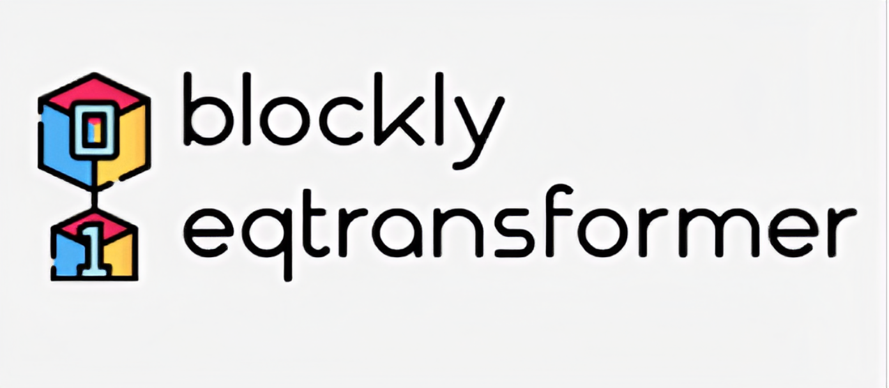

# Blockly Earthquake Transformer
[](https://doi.org/10.5281/zenodo.7112235)

Blockly Earthquake Transformer (BET) was born from the need for seismologists and developers who are not AI specialists to easily, quickly, and independently build seismic phase pickers. BET is an open source platform that automates and simplifies developing and managing deep learning solutions for seismic signal detection and phase picking. It is designed as a web app allowing you to focus on developing your deep learning code & automation, while BET ensures your work is reproducible and scalable.

Blockly Earthquake Transformer (BET) is driven by the-state-of-art AI model - [EQTranformer(EqT)](https://github.com/smousavi05/EQTransformer) from [Mousavi et al. (2020)](https://www.nature.com/articles/s41467-020-17591-w.epdf?sharing_token=IiqAaF4NxwhUWGQLLLyTw9RgN0jAjWel9jnR3ZoTv0Nn-FaUKb3nu4lFkVXeZX_BCz5eMr5DkfCxQ3XASbeWwldzdU9oZF3d2MMG4cz6GWhVklzzzlL0QeMcf9kJJxA8wJAFfFCmtdlpQklDmGG7qRVjJxlCK-nusJjMFWE2oEk%3D).
## Introduction
Blockly Earthquake Transformer is a no-code, deep learning approach using the EqT model. BET presents users with an interactive form enabling them to upload their data and customize the model and arguments to create their workflows. Once the form is filled out, BET executes the corresponding phase picking task without requiring the user to interact directly with the code. This tool is designed to simplify EqT applications to various fields, such as local events, teleseismic earthquakes and microseismicity. Here, users can detect events using the pretrained EqT model, re-train and deploy new models with the EqT architecture. In addition, transfer learning and fine-tuning functions are implemented in BET. In the transfer learning module, BET extends the phase picking range from P and S phase to additional phase types, e.g., Pn, Pg, Sn, Sg (based on the labeled training data), etc. In the fine-tuning module, detailed model architecture can be customized by users to build new models that may achieve better performance on specific projects than currently published models. This repository is for fast deployment of reusable workflows, building customized models, visualizing training processes and producing publishable figures in a lightweight, interactive, open-source Python toolbox.

Installation, usage, documentation and scripts are described at
 https://github.com/maihao14/BlocklyEQTransformer

Author: [`Hao Mai`](https://www.uogeophysics.com/authors/mai/)(Developer and Maintainer)
 & [`Pascal Audet`](https://www.uogeophysics.com/authors/admin/) (Developer and Maintainer)

## Installation

### Installing from GitHub source

Download or clone the repository:
```bash
git clone https://github.com/maihao14/BlocklyEQTransformer.git
cd BlocklyEQTransformer
```

### Create New Conda Environment

We recommend creating a custom
[conda environment](https://conda.io/docs/user-guide/tasks/manage-environments.html)
where `Blockly Earthquake Transformer` can be installed along with its dependencies.

- Create a environment called `bet`:

```bash
conda create -n bet python=3.7
```

- Activate the newly created environment:

```bash
conda activate bet
```

- Install recommended dependencies:

```bash
 conda env create -f environment.yml
```

- Install `BlocklyEQTransformer` using `pip`:

```bash
pip install -e .
```

### JupyterLab preview extension (Optional)

Voilà provides a JupyterLab extension that displays a Voilà preview of your Notebook in a side-pane.

Starting with JupyterLab 3.0, the extension is **automatically installed** after installing `voila`
with `pip install voila`.

If you would like to install the extension from source, run the following command.

```
jupyter labextension install @voila-dashboards/jupyterlab-preview
```

## Get Started
### Open a terminal and enter notebook directory
```bash
cd notebook
jupyter notebook
```

### Option One: As a standalone application

To render the `blocklyeqt` example notebook as a standalone app, run
```bash
voila blocklyeqt.ipynb
```
To serve a directory of Jupyter notebooks, run `voila` with no argument.


### Option Two: Render the notebook within Jupyter
Voilà can also be used as a Jupyter server extension, both with the
[notebook](https://github.com/jupyter/notebook) server or with
[jupyter_server](https://github.com/jupyter/jupyter_server).

To install the Jupyter server extension, run

```bash
jupyter serverextension enable voila
jupyter server extension enable voila
```

When running the Jupyter server, the Voilà app is accessible from the base url uffixed with `voila`. Open `blocklyeqt.ipynb` via your local [Jupyter Notebook](https://jupyter.org/) or [Jupyter Lab]((https://jupyter.org/)). Click on `Voilà` icon [](jupytericon.png)


### Start a Model Training
Fill in the blocks with your preferred settings. Click on `Launch`, the model training module will automatically run.


### Check performance
When you finish a training procedure, click on `Training Performance` module. You can easily view the loss function figure and related training results. 

### Deployment/ Prediction
Once you get a trained model, you can run it in deployment module to fast deploy in your field data.


## Contributing

All constructive contributions are welcome, e.g. bug reports, discussions or suggestions for new features. You can either [open an issue on GitHub](https://github.com/maihao14/BlocklyEQTransformer/issues) or make a pull request with your proposed changes. Before making a pull request, check if there is a corresponding issue opened and reference it in the pull request. If there isn't one, it is recommended to open one with your rationale for the change. New functionality or significant changes to the code that alter its behaviour should come with corresponding tests and documentation. If you are new to contributing, you can open a work-in-progress pull request and have it iteratively reviewed. Suggestions for improvements (speed, accuracy, etc.) are also welcome.

## Citation
[](https://doi.org/10.5281/zenodo.7112235)
