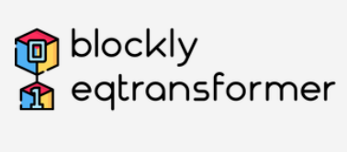

# Blockly Earthquake Transformer
Blockly Earthquake Transformer (BET) was born from the need for seismologists and developers who are not AI specialists to easily, quickly, and independently build seismic phase phickers.

## Introduction
Blockly Earthquake Transformer is a no-code, deep learning approach using the EqT model. BET presents to users an interactive form enabling them to upload their data and customize the model and arguments to create their workflows. Once the form is filled out, BET executes the corresponding phase picking task without requiring the user to interact directly with the code. This tool is designed to simplify EqT applications to various fields, such as local events, teleseismic earthquakes and microseismicity. Here, users are able to detect events using the trained EqT model, train and evaluate new models with the original EqT architecture. In addition, transfer learning and fine-tuning functions are implemented in BET. In the transfer learning module, BET extends the phase picking range from P and S phase to additional phase types, e.g., Pn, Pg, Sn, Sg (based on the labeled training data), etc. In the fine-tuning module, detailed model architecture can be customized by users to build new models that may achieve better performance on specific projects than currently published models. We also present results from a small-scale transfer learning to accomplish Pg and Sg picking tasks in BET. The contribution of this work is in showing the potential for fast deployment of reusable workflows, building customized models, visualizing training processes and producing publishable figures in a lightweight, interactive, open-source Python toolbox.

Installation, Usage, documentation and scripts are described at
 https://maihao14.github.io/QuakeLabeler/

Author: [`Hao Mai`](https://www.uogeophysics.com/authors/mai/)(Developer and Maintainer)
 & [`Pascal Audet`](https://www.uogeophysics.com/authors/admin/) (Developer and Maintainer)

## Installation

### Conda environment

We recommend creating a custom
[conda environment](https://conda.io/docs/user-guide/tasks/manage-environments.html)
where `Blockly Earthquake Transformer` can be installed along with its dependencies.

- Create a environment called `bet` and install `pygmt`:

```bash
conda create -n bet gmt python=3.8
```

- Activate the newly created environment:

```bash
conda activate ql
```

### Installing from source

Download or clone the repository:
```bash
git clone https://github.com/maihao14/QuakeLabeler.git
cd QuakeLabeler
```

```bash
pip install -e .
```

## Running the scripts

Create a work folder where you will run the scripts that accompany `QuakeLabeler`. For example:

```bash
mkdir ./WorkFolder
cd WorkFolder
```

Run `QuakeLabeler`. Input ``QuakeLabeler`` to `macOS terminal` or `Windows consoles`:

```bash
QuakeLabeler
```

Or input ``quakelabeler`` also works:

```bash
quakelabeler
```

A QuakeLabeler welcome interface will be loading:

```bash
(ql) hao@HaodeMacBook-Pro QuakeLabeler % QuakeLabeler
Welcome to QuakeLabeler----Fast AI Earthquake Dataset Deployment Tool!
QuakeLabeler provides multiple modes for different levels of Seismic AI researchers

[Beginner] mode -- well prepared case studies;
[Advanced] mode -- produce earthquake samples based on Customized parameters.
```


## Contributing
In current version, raw waveforms data from part of Chinese Earthquake stations are unavailable to access automatically (But you can still use QuakeLabeler in China). Any collaborators are welcome to help extend the data sources, develop the codes, etc.

All constructive contributions are welcome, e.g. bug reports, discussions or suggestions for new features. You can either [open an issue on GitHub](https://github.com/maihao14/QuakeLabeler/issues) or make a pull request with your proposed changes. Before making a pull request, check if there is a corresponding issue opened and reference it in the pull request. If there isn't one, it is recommended to open one with your rationale for the change. New functionality or significant changes to the code that alter its behavior should come with corresponding tests and documentation. If you are new to contributing, you can open a work-in-progress pull request and have it iteratively reviewed. Suggestions for improvements (speed, accuracy, etc.) are also welcome.
